# How much will your taxi trip cost in New York City?
---

Author: Apoorv Mittal 

The data which we have loaded will help me predict the fare amount which is my dependent variable. We will be trying to predict this by the pickup location (latitude and longitude), dropoff location, number of passengers, time of the day and the week of the day. We will also try and adding some features which we extract from our data itself. In the end we will analyse which features were considered the best. 


## Table of Contents

1. [Getting Started](#Getting-Started)
    - [1.1 Importing Libraries](#1.1-Importing-Libraries)
    - [1.2 Dataset Source](#1.2-Dataset-Source)
    - [1.3 Reading the data](#1.3-Reading-the-data)
    - [1.4 Describing the data](#1.4-Describing-the-data)
    
2. [Cleaning the data](#Cleaning-the-data)
    - [2.1 Fare](#2.1-Cleaning-Fare)
    - [2.2 Passenger Count](#2.2-Cleaning-Passenger-Count)
    - [2.3 Pickup and Dropoff Coordinates](#2.3-Cleaning-Coordinates)
3. [Visualizing data](#Visualizing-data) 
    - [3.1 Pickup Locations](#3.1-Pickup-Locations)
    - [3.2 Dropoff Locations](#3.2-Dropoff-Locations)
    - [3.3 Fares Locations](#3.3-Fares-Locations)

4. [Adding features](#Adding-features)
    - [4.1 Distances](#4.1-Distances)
        - [Haversine distance](#Haversine-distance)
        - [Taxicab Distance](#Taxicab-Distance)
        - [Euclidean distance](#Euclidean-distance)
        - [Vertical or horizontal distance](#Vertical-or-horizontal-distance)
    - [4.2 Fare Per Kilometer](#4.2-Fare-Per-Kilometer)
    - [4.3 Time](#4.3-Time)
5. [Machine Learning](#Machine-Learning)  
    - [5.1 Splitting Data](#5.1-Splitting-Data)
    - [5.2 Finding Correlations](#5.2-Finding-Correlations)
    - [5.3 Hypothesis Testing](#5.3-Hypothesis-Testing)
    - [5.4 F Tests](#5.3-F-Tests)
    - [5.5 Making Predictions](#5.5-Making-Predictions)
        - [Linear Model](#Linear-Model)
        - [Random Forest](#Random-Forest)
        - [K-NN model](#K-NN-model)
        - [Decision Trees](#Decision-Trees)
        - [Linear SVR](#Linear-SVR)
6. [Conclusion](#Conclusion)


# Getting Started
## 1.1 Importing Libraries

Before we see what the data is all about let's get our notebook ready. We will need all the libraries which we have used thoroughout the semester. 


```python
# Pandas and numpy for data manipulation
import pandas as pd
import numpy as np

# Pandas display options
pd.set_option('display.float_format', lambda x: '%.3f' % x)

# Visualizations
import matplotlib.pyplot as plt
%matplotlib inline

plt.style.use('fivethirtyeight')
plt.rcParams['font.size'] = 18


import seaborn as sns

# Ignore warnings
import warnings
warnings.filterwarnings('ignore')

# datetime to tell day of the week
import datetime

# See residual relationship in models
from numpy.polynomial.polynomial import polyfit
```

## 1.2 Dataset Source


The data for this project was collected from [kaggle](https://www.kaggle.com/c/new-york-city-taxi-fare-prediction) from their cometitions tab. 

## 1.3 Reading the data

We have a huge dataset of 55 million values while I have a puny computer and therefore it takes a really big toll reading all the data in a dataframe. As a result we will reading around a million values and then we can always add more data to make our predictions better. 

We also tell pandas to automatically parse the data in the data file and all drop the `key` column which contains a unique identifier for every trip but it would not help us to predict anything with the trip. Lastly we remove any row with a missing entry because we cannot fill them our selves. We will touch on this topic later. 


```python
data = pd.read_csv('NYC Taxi Fare Data/train.csv', nrows = 1_000_000, 
                   parse_dates = ['pickup_datetime']).drop(columns = 'key')

# Remove na
data = data.dropna()
data.head()
```


<div>
<style scoped>
    .dataframe tbody tr th:only-of-type {
        vertical-align: middle;
    }

    .dataframe tbody tr th {
        vertical-align: top;
    }

    .dataframe thead th {
        text-align: right;
    }
</style>
<table border="1" class="dataframe">
  <thead>
    <tr style="text-align: right;">
      <th></th>
      <th>fare_amount</th>
      <th>pickup_datetime</th>
      <th>pickup_longitude</th>
      <th>pickup_latitude</th>
      <th>dropoff_longitude</th>
      <th>dropoff_latitude</th>
      <th>passenger_count</th>
    </tr>
  </thead>
  <tbody>
    <tr>
      <th>0</th>
      <td>4.500</td>
      <td>2009-06-15 17:26:21</td>
      <td>-73.844</td>
      <td>40.721</td>
      <td>-73.842</td>
      <td>40.712</td>
      <td>1</td>
    </tr>
    <tr>
      <th>1</th>
      <td>16.900</td>
      <td>2010-01-05 16:52:16</td>
      <td>-74.016</td>
      <td>40.711</td>
      <td>-73.979</td>
      <td>40.782</td>
      <td>1</td>
    </tr>
    <tr>
      <th>2</th>
      <td>5.700</td>
      <td>2011-08-18 00:35:00</td>
      <td>-73.983</td>
      <td>40.761</td>
      <td>-73.991</td>
      <td>40.751</td>
      <td>2</td>
    </tr>
    <tr>
      <th>3</th>
      <td>7.700</td>
      <td>2012-04-21 04:30:42</td>
      <td>-73.987</td>
      <td>40.733</td>
      <td>-73.992</td>
      <td>40.758</td>
      <td>1</td>
    </tr>
    <tr>
      <th>4</th>
      <td>5.300</td>
      <td>2010-03-09 07:51:00</td>
      <td>-73.968</td>
      <td>40.768</td>
      <td>-73.957</td>
      <td>40.784</td>
      <td>1</td>
    </tr>
  </tbody>
</table>
</div>


## 1.4 Describing the data

Our Dataframe has the following columns\:

* pickup_datetime - timestamp value indicating when the taxi ride started.
* pickup_longitude - float for longitude coordinate of where the taxi ride started.
* pickup_latitude - float for latitude coordinate of where the taxi ride started.
* dropoff_longitude - float for longitude coordinate of where the taxi ride ended.
* dropoff_latitude - float for latitude coordinate of where the taxi ride ended.
* passenger_count - integer indicating the number of passengers in the taxi ride.


Let's see what is the summary of statistics of our data. 


```python
data.describe()
```


<div>
<style scoped>
    .dataframe tbody tr th:only-of-type {
        vertical-align: middle;
    }

    .dataframe tbody tr th {
        vertical-align: top;
    }

    .dataframe thead th {
        text-align: right;
    }
</style>
<table border="1" class="dataframe">
  <thead>
    <tr style="text-align: right;">
      <th></th>
      <th>fare_amount</th>
      <th>pickup_longitude</th>
      <th>pickup_latitude</th>
      <th>dropoff_longitude</th>
      <th>dropoff_latitude</th>
      <th>passenger_count</th>
    </tr>
  </thead>
  <tbody>
    <tr>
      <th>count</th>
      <td>999990.000</td>
      <td>999990.000</td>
      <td>999990.000</td>
      <td>999990.000</td>
      <td>999990.000</td>
      <td>999990.000</td>
    </tr>
    <tr>
      <th>mean</th>
      <td>11.348</td>
      <td>-72.527</td>
      <td>39.929</td>
      <td>-72.528</td>
      <td>39.920</td>
      <td>1.685</td>
    </tr>
    <tr>
      <th>std</th>
      <td>9.822</td>
      <td>12.058</td>
      <td>7.626</td>
      <td>11.324</td>
      <td>8.201</td>
      <td>1.324</td>
    </tr>
    <tr>
      <th>min</th>
      <td>-44.900</td>
      <td>-3377.681</td>
      <td>-3116.285</td>
      <td>-3383.297</td>
      <td>-3114.339</td>
      <td>0.000</td>
    </tr>
    <tr>
      <th>25%</th>
      <td>6.000</td>
      <td>-73.992</td>
      <td>40.735</td>
      <td>-73.991</td>
      <td>40.734</td>
      <td>1.000</td>
    </tr>
    <tr>
      <th>50%</th>
      <td>8.500</td>
      <td>-73.982</td>
      <td>40.753</td>
      <td>-73.980</td>
      <td>40.753</td>
      <td>1.000</td>
    </tr>
    <tr>
      <th>75%</th>
      <td>12.500</td>
      <td>-73.967</td>
      <td>40.767</td>
      <td>-73.964</td>
      <td>40.768</td>
      <td>2.000</td>
    </tr>
    <tr>
      <th>max</th>
      <td>500.000</td>
      <td>2522.271</td>
      <td>2621.628</td>
      <td>45.582</td>
      <td>1651.553</td>
      <td>208.000</td>
    </tr>
  </tbody>
</table>
</div>


As you can we have 10 less than a million values. Those 10 are the ones we removed as they had missing entries. Moreover this table also shows us that our data has a lot of outlier. For example, the minimum value of `fare_amount` is negative which is absolutely rubbish. Also minimum and maximum values of `latitude` and `longitute` of pickup and dropoff locations are literally out of the Earth. Even there have been rides with 0 `passenger_count` and some with 208 people. Clearly we will need to do a lot of cleaning even before we are able to use this data. 

# Cleaning the data

As we saw above we need to clean a lot our data. First, lets look at the how our dependent variable `fare_amount` is distrubuted. 


```python
plt.figure(figsize= (15,8))
sns.distplot(data.fare_amount)
plt.title('Distribution of Fare')
```


    Text(0.5, 1.0, 'Distribution of Fare')


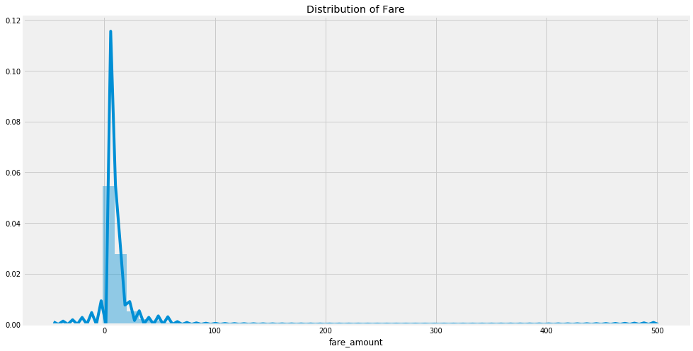


## 2.1 Cleaning Fare

First lets remove all Outliers from `fare_amount`. According to [investopedia.com](https://www.investopedia.com/articles/personal-finance/021015/uber-versus-yellow-cabs-new-york-city.asp) the minimum fare of a taxi is \\$2.5. I will also remove any `fare_amount` more than \$150 because I believe that fare more than that has to be of someone going outside NYC and therefore useless to our model. 


```python
data = data[data.fare_amount >= 2.5][data.fare_amount <= 150]
```

Now lets create bins for teh `fare_amount`. This will help us with analysis later. 


```python
# Bin the fare and convert to string
binss = list(range(0, 50, 5))
data['fare_bin'] = pd.cut(data.fare_amount, bins = binss).astype(str)

# replace so that sorting is correct this took me sooo long to figure out bro
data.loc[data['fare_bin'] == '(5, 10]', 'fare_bin'] = '(05, 10]'

# As you could see in the Distribution of fare above there are not a lot of fares after 45 so lets put then in one bin
data.loc[data['fare_bin'] == 'nan', 'fare_bin'] = '[45+]'

data.fare_bin.value_counts().sort_index().plot.bar(color="g")
plt.title('Fares in bins')
```


    Text(0.5, 1.0, 'Fares in bins')


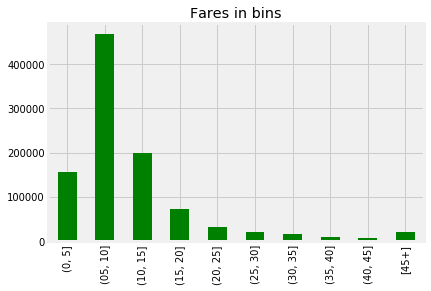


## 2.2 Cleaning Passenger Count

Now lets take a look at outliers in `passenger_count`


```python
data.passenger_count.value_counts().sort_index().plot.bar(color="g")
plt.title('Trips with # of passengers')
```


    Text(0.5, 1.0, 'Trips with # of passengers')


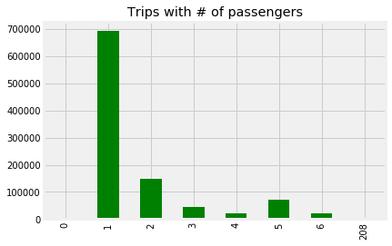


As you can see we should just remove trips with `passenger_count` <=0 or > 6.


```python
data = data[data.passenger_count > 0][data.passenger_count <= 6]
```

## 2.3 Cleaning Coordinates

Now lets see what we can do about the `latitude` and `longitudes` of the pickup and dropoff locations. 


```python
plt.scatter(x = data.pickup_longitude, y = data.pickup_latitude )
```


    <matplotlib.collections.PathCollection at 0x11ec2a588>


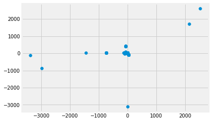


As we can see we have no clue what ranges of latitue and longitudes NYC comes in. Therefore lets search online. 

After a lot of time I got to know where does every map gets its map and the site is [openstreetmap.org](https://www.openstreetmap.org/export#map=11/40.7353/-73.8607) and this is where I searched for NYC city limit latitude and longitute. This comes out to be 40.9317 to 40.5425 for latitude and -74.2065 to -73.6029 for longitute. So now lets remove those outliers. 


```python
# pickup 
data = data[data.pickup_longitude >= -74.2065][data.pickup_longitude <= -73.6029]
data = data[data.pickup_latitude >= 40.5425][data.pickup_latitude <= 40.9317]

# dropoff 
data = data[data.dropoff_longitude >= -74.2065][data.dropoff_longitude <= -73.6029]
data = data[data.dropoff_latitude >= 40.5425][data.dropoff_latitude <= 40.9317]
```

Now lets see our magnaficent clean data:


```python
data.describe()
```


<div>
<style scoped>
    .dataframe tbody tr th:only-of-type {
        vertical-align: middle;
    }

    .dataframe tbody tr th {
        vertical-align: top;
    }

    .dataframe thead th {
        text-align: right;
    }
</style>
<table border="1" class="dataframe">
  <thead>
    <tr style="text-align: right;">
      <th></th>
      <th>fare_amount</th>
      <th>pickup_longitude</th>
      <th>pickup_latitude</th>
      <th>dropoff_longitude</th>
      <th>dropoff_latitude</th>
      <th>passenger_count</th>
    </tr>
  </thead>
  <tbody>
    <tr>
      <th>count</th>
      <td>974467.000</td>
      <td>974467.000</td>
      <td>974467.000</td>
      <td>974467.000</td>
      <td>974467.000</td>
      <td>974467.000</td>
    </tr>
    <tr>
      <th>mean</th>
      <td>11.298</td>
      <td>-73.975</td>
      <td>40.751</td>
      <td>-73.974</td>
      <td>40.751</td>
      <td>1.691</td>
    </tr>
    <tr>
      <th>std</th>
      <td>9.414</td>
      <td>0.035</td>
      <td>0.027</td>
      <td>0.034</td>
      <td>0.031</td>
      <td>1.306</td>
    </tr>
    <tr>
      <th>min</th>
      <td>2.500</td>
      <td>-74.205</td>
      <td>40.547</td>
      <td>-74.205</td>
      <td>40.543</td>
      <td>1.000</td>
    </tr>
    <tr>
      <th>25%</th>
      <td>6.000</td>
      <td>-73.992</td>
      <td>40.737</td>
      <td>-73.992</td>
      <td>40.736</td>
      <td>1.000</td>
    </tr>
    <tr>
      <th>50%</th>
      <td>8.500</td>
      <td>-73.982</td>
      <td>40.753</td>
      <td>-73.981</td>
      <td>40.754</td>
      <td>1.000</td>
    </tr>
    <tr>
      <th>75%</th>
      <td>12.500</td>
      <td>-73.968</td>
      <td>40.768</td>
      <td>-73.965</td>
      <td>40.768</td>
      <td>2.000</td>
    </tr>
    <tr>
      <th>max</th>
      <td>150.000</td>
      <td>-73.604</td>
      <td>40.931</td>
      <td>-73.603</td>
      <td>40.932</td>
      <td>6.000</td>
    </tr>
  </tbody>
</table>
</div>


**Interesting fact** The mean of the `latitudes` and `longitudes` come out to be the same latitude and longitude which google maps gives us when you write New York City. 

Now Finally lets remove any locations with the same coordinates for pickup and dropoff locations


```python
data = data[data['pickup_longitude'] !=  data['dropoff_longitude']][data['pickup_latitude'] != data['dropoff_latitude']]
```


```python
data.head()
```


<div>
<style scoped>
    .dataframe tbody tr th:only-of-type {
        vertical-align: middle;
    }

    .dataframe tbody tr th {
        vertical-align: top;
    }

    .dataframe thead th {
        text-align: right;
    }
</style>
<table border="1" class="dataframe">
  <thead>
    <tr style="text-align: right;">
      <th></th>
      <th>fare_amount</th>
      <th>pickup_datetime</th>
      <th>pickup_longitude</th>
      <th>pickup_latitude</th>
      <th>dropoff_longitude</th>
      <th>dropoff_latitude</th>
      <th>passenger_count</th>
      <th>fare_bin</th>
    </tr>
  </thead>
  <tbody>
    <tr>
      <th>0</th>
      <td>4.500</td>
      <td>2009-06-15 17:26:21</td>
      <td>-73.844</td>
      <td>40.721</td>
      <td>-73.842</td>
      <td>40.712</td>
      <td>1</td>
      <td>(0, 5]</td>
    </tr>
    <tr>
      <th>1</th>
      <td>16.900</td>
      <td>2010-01-05 16:52:16</td>
      <td>-74.016</td>
      <td>40.711</td>
      <td>-73.979</td>
      <td>40.782</td>
      <td>1</td>
      <td>(15, 20]</td>
    </tr>
    <tr>
      <th>2</th>
      <td>5.700</td>
      <td>2011-08-18 00:35:00</td>
      <td>-73.983</td>
      <td>40.761</td>
      <td>-73.991</td>
      <td>40.751</td>
      <td>2</td>
      <td>(05, 10]</td>
    </tr>
    <tr>
      <th>3</th>
      <td>7.700</td>
      <td>2012-04-21 04:30:42</td>
      <td>-73.987</td>
      <td>40.733</td>
      <td>-73.992</td>
      <td>40.758</td>
      <td>1</td>
      <td>(05, 10]</td>
    </tr>
    <tr>
      <th>4</th>
      <td>5.300</td>
      <td>2010-03-09 07:51:00</td>
      <td>-73.968</td>
      <td>40.768</td>
      <td>-73.957</td>
      <td>40.784</td>
      <td>1</td>
      <td>(05, 10]</td>
    </tr>
  </tbody>
</table>
</div>


# Visualizing data

Now lets see the plot of pickup locations and dropoff locations.


```python
coordinate_tuple = (-74.1508, -73.7320, 40.5618, 40.9309)
seed = 100
nyc = plt.imread('map.png')
# this function is used to plot data on the NYC map lat and long is Series of locations to be plotted, 
# coordinates is the max values of the map, myc_map is 
#  the new york map, s is the marker size, alpha is blending value, 
# title is the  title of the plot, color is color of plot
def plot_on_map(lat, long, coordinates = coordinate_tuple, nyc_map =nyc , s=10, alpha=0.2,title = 'NYC Map', color = 'r'):
    fig, axs = plt.subplots(figsize=(12, 16))
    
    axs.scatter(long, lat, zorder=1, alpha=alpha, c=color, s=s)
    axs.set_xlim((coordinates[0], coordinates[1]))
    axs.set_ylim((coordinates[2], coordinates[3]))
    axs.set_title(title)
    axs.imshow(nyc_map, zorder=0, extent=coordinates)
```

##  3.1 Pickup Locations 

First lets create a random sample of **pickup locations** and plot it on an image of NYC. 


```python
# plot training data on map zoomed in
plot_on_map(lat = data.pickup_latitude, long = data.pickup_longitude, s=0.5, alpha=0.05, title ='Pickup locations')
```


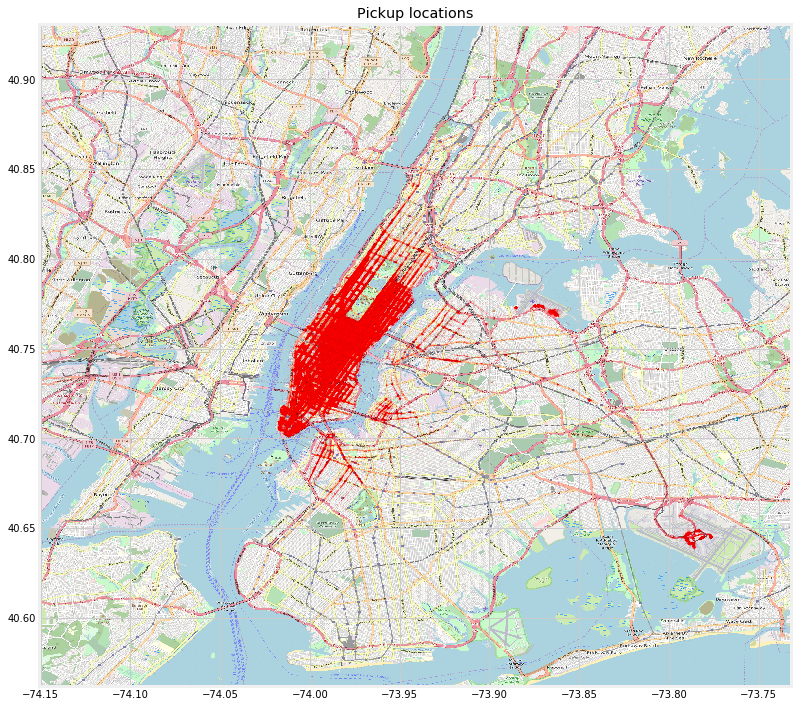


##  3.2 Dropoff Locations

Now lets create a map for the **dropoff** locations 


```python
plot_on_map(lat = data.dropoff_latitude, long = data.dropoff_longitude, s=0.5, alpha=0.05, 
            title ='Dropoff locations', color= 'm')
```


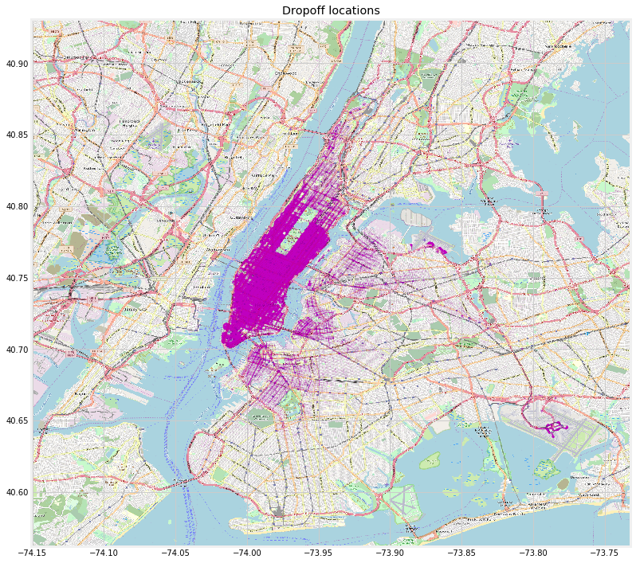


This looks great. We can see most of the rides start in Manhattan and end in Manhattan but a significant amount also do end in Brooklyn. Also a lot of them start and end at the La Guardia and John F Kennedy airports. Now lets plot according to fare.

## 3.3 Fares Locations


```python
# giving unique colors to every bin
colors = ['b','g','r','c','m','y','yellowgreen','tan','plum','goldenrod']
```


```python
params = {'legend.fontsize': 20,
          'legend.handlelength': 2}
plt.rcParams.update(params)

fig, axes = plt.subplots(figsize=(12, 16))
# keeps track of index of colors for the bins
i = 0;

# Plotting the fares according to bins
for b, df in data.groupby('fare_bin'):
    axes.scatter(df.pickup_longitude, df.pickup_latitude, alpha=0.2, c=colors[i], s=0.5, label = f'{b}')
    axes.set_xlim((coordinate_tuple[0], coordinate_tuple[1]))
    axes.set_ylim((coordinate_tuple[2], coordinate_tuple[3]))
    axes.set_title('Pickup locations')
    i = i+1
    
    
legend = axes.legend(loc=(1.04,0),markerscale=30)    
legend.set_title('Fare Bin')
# finally showing the plot    
axes.imshow(nyc, zorder=0, extent=coordinate_tuple)    
```


    <matplotlib.image.AxesImage at 0x11ebd6a20>


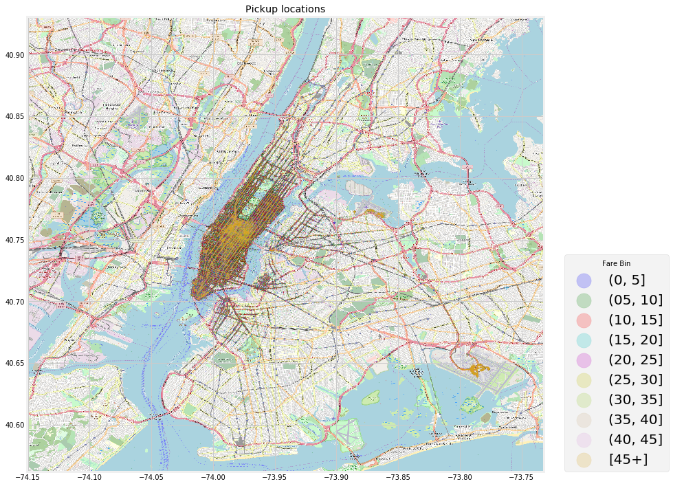


Now lets plot the dropoff locations


```python
fig, axes = plt.subplots(figsize=(12, 16))
# keeps track of index of colors for the bins
i = 0;

# Plotting the fares according to bins
for b, df in data.groupby('fare_bin'):
    axes.scatter(df.dropoff_longitude, df.dropoff_latitude, alpha=0.2, c=colors[i], s=0.5, label = f'{b}')
    axes.set_xlim((coordinate_tuple[0], coordinate_tuple[1]))
    axes.set_ylim((coordinate_tuple[2], coordinate_tuple[3]))
    axes.set_title('Dropoff locations')
    i = i+1

# finally showing the plot     
legend = axes.legend(loc=(1.04,0) , markerscale=30)    
legend.set_title('Fare Bin')

axes.imshow(nyc, zorder=0, extent=coordinate_tuple)  
```


    <matplotlib.image.AxesImage at 0x11ebc37f0>


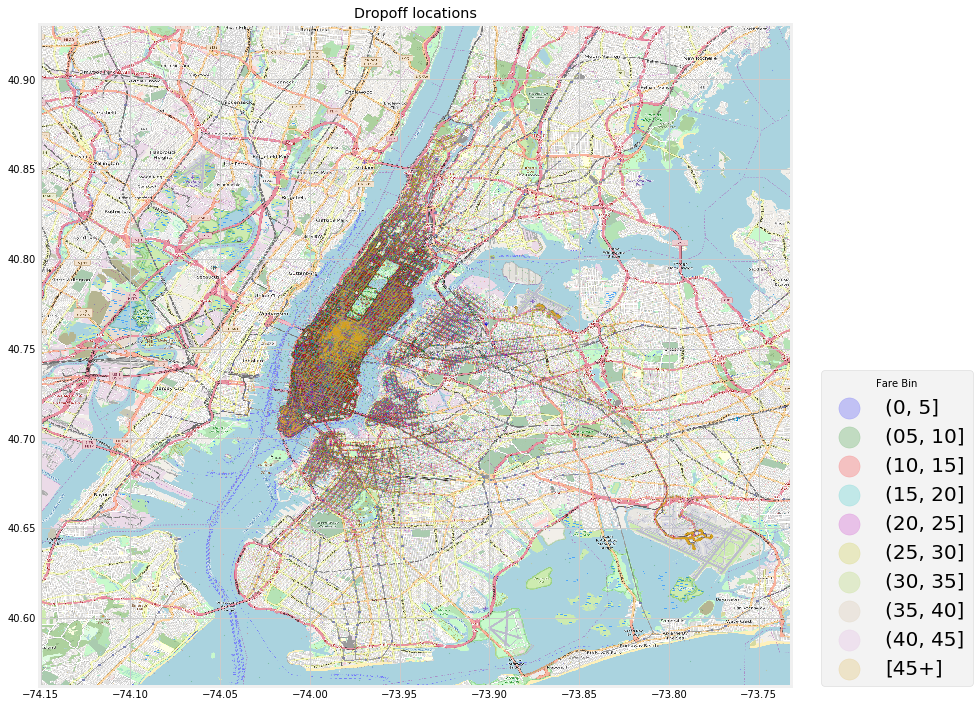


As you can see there is slight difference in the fares for the week and the highest fare is on Sunday. We will take a look at the correlation of this later. 

# Adding features 

## 4.1 Distances

### Haversine distance

Now lets add a distance column in the dataframe. Here the distance we are trying to add is the **Haversine distance** which is the Actual distance between two coordinate points. The formula for Haversine distance is:

$${\displaystyle =2r\arcsin \left({\sqrt {\sin ^{2}\left({\frac {\varphi _{2}-\varphi _{1}}{2}}\right)+\cos(\varphi _{1})\cos(\varphi _{2})\sin ^{2}\left({\frac {\lambda _{2}-\lambda _{1}}{2}}\right)}}\right)}$$


```python
# approximate radius of earth in km
R = 6373.0

# takes in coordiantes and returns distance in kilometers
def haversine_distance(lat1,long1,lat2,long2):
    lat1 = np.radians(lat1)
    long1 = np.radians(long1)
    lat2 = np.radians(lat2)
    long2 = np.radians(long2)

    dlon = long2 - long1
    dlat = lat2 - lat1

    a = np.sin(dlat / 2)**2 + np.cos(lat1) * np.cos(lat2) * np.sin(dlon / 2)**2
    c = 2 * np.arcsin(np.sqrt(a))

    distance = R * c
    return distance

data['haversine_distance'] =  haversine_distance(data.pickup_latitude,data.pickup_longitude,
                                    data.dropoff_latitude,data.dropoff_longitude)
```


```python
for b, df in data.groupby('fare_bin'):
    ax = sns.kdeplot(df.haversine_distance,  label = f'{b}')
    legend = ax.legend(loc=(1.04,0),markerscale=5) 
    legend.set_title('Fare Bin')
```


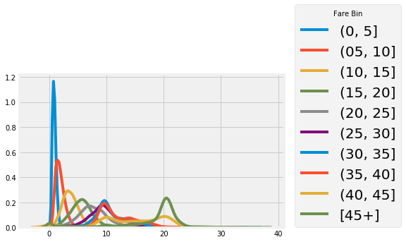


Before analysing this distance lets see if it agrees with common sense like the fare increases with increase in distance. For every distance this is very important otherwise either our data is bad or society does not make sense once again. 


```python
data.groupby('fare_bin')['haversine_distance'].mean().plot.bar(color = 'g')
plt.title('Average Fare by Haversine Distance')
```


    Text(0.5, 1.0, 'Average Fare by Haversine Distance')


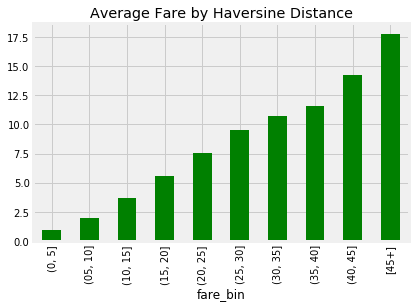


it looks like this shows as you increase distance the fare increases so the data is good. 

This is the Actual distance between coordinates but what if the city was considered a 2D space and then the coordinates taken. So therefore lets add some more distance related columns in our dataframe. 

### Taxicab Distance

After searching through wikipedia I saw a something called **[Taxicab geometry](https://en.wikipedia.org/wiki/Taxicab_geometry)** which basically tells us a distance in city blocks. The taxicab metric is also known as rectilinear distance, L1 distance, L1 distance , snake distance, city block distance, Manhattan distance or Manhattan length, with corresponding variations in the name of the geometry. The latter names allude to the grid layout of most streets on the island of Manhattan, which causes the shortest path a car could take between two intersections in the borough to have length equal to the intersections' distance in taxicab geometry. The formula for the distance is:

$${\displaystyle D\left(X,Y\right)=|x_{1}-y_{1}| + |x_{2}-y_{2}| }$$


```python
def manhattan_distance(lat1,long1,lat2,long2):
    return abs(lat1-lat2) + abs(long1-long2) 

data['manhattan_distance'] =  manhattan_distance(data.pickup_latitude,data.pickup_longitude,
                                    data.dropoff_latitude,data.dropoff_longitude)
```


```python
for b, df in data.groupby('fare_bin'):
    ax = sns.kdeplot(df.manhattan_distance,  label = f'{b}')
    legend = ax.legend(loc=(1.04,0),markerscale=5) 
    legend.set_title('Fare Bin')
```


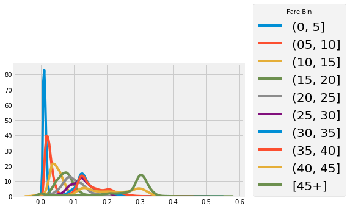


```python
data.groupby('fare_bin')['manhattan_distance'].mean().plot.bar(color = 'g')
plt.title('Average Fare by Manhattan Distance')
```


    Text(0.5, 1.0, 'Average Fare by Manhattan Distance')


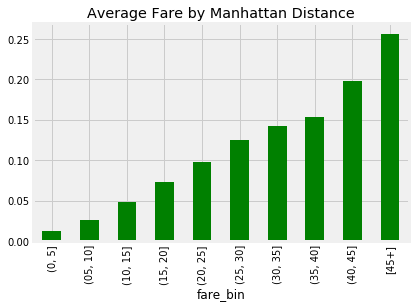


### Euclidean distance

While we are on the topic of distances, we should not disregard the Euclidean distance because it might be better to use and might be more correlated to `fare_amount`. The formula for the Euclidean distance is:

$${\displaystyle D\left(X,Y\right)= \bigg(|x_{1}-y_{1}|^2 + |x_{2}-y_{2}|^2\bigg)^{1/2}}$$


```python
def euclidean_distance(lat1,long1,lat2,long2):
    return (abs(lat1-lat2) ** 2 + abs(long1-long2) ** 2) **(1/2)

data['euclidean_distance'] =  euclidean_distance(data.pickup_latitude,data.pickup_longitude,
                                    data.dropoff_latitude,data.dropoff_longitude)
```


```python
for b, df in data.groupby('fare_bin'):
    ax = sns.kdeplot(df.euclidean_distance,  label = f'{b}')
    legend = ax.legend(loc=(1.04,0),markerscale=5) 
    legend.set_title('Fare Bin')
```


```python
data.groupby('fare_bin')['euclidean_distance'].mean().plot.bar(color = 'g')
plt.title('Average Fare by Euclidean Distance')
```


    Text(0.5, 1.0, 'Average Fare by Euclidean Distance')


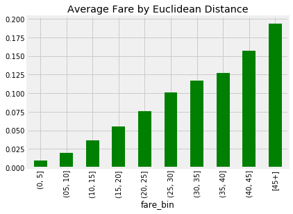


### Vertical or horizontal distance

It might be the case where the it might be dependent on the vertical distance (differences between longitudes) or horizontal distance( differences between latitudes) or the sum of both. 


```python
data['lat_diff'] = abs(data['dropoff_latitude'] - data['pickup_latitude'])
data['long_diff'] = abs(data['dropoff_longitude'] - data['pickup_longitude'])
```

## 4.2 Fare Per Kilometer 

Finally, before we apply machine learning lets just take a look at the `fare_amount` and `passenger_count`. 


```python
data.groupby('passenger_count')['fare_amount'].mean().plot.bar(color = 'g')
plt.title('Average Fare by Passenger Count')
```


    Text(0.5, 1.0, 'Average Fare by Passenger Count')


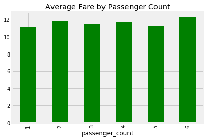


It does not look like a lot of changes in the average fare by passenger count. This is expected because when you call a taxi it does not charge by the number of people you have. Nowdays Uber and lyft have just started the sharing of taxi but that data is not existent in my data.

Finally lets add what the fare per distance was:


```python
data['fare_per_km'] = data.fare_amount / data.haversine_distance
```

## 4.3 Time 

Now lets add time parameters. This might be a really useful feature. 


```python
# add day to the data
week = ['Monday','Tuesday', 'Wednesday', 'Thursday', 'Friday', 'Saturday','Sunday']
def add_week_day(row):
    return week[row['pickup_datetime'].weekday()]
data['pickup_day'] = data.apply(add_week_day, axis=1)

def add_weekcode(row):
    return row['pickup_datetime'].weekday()

data['day'] = data.apply(add_weekcode, axis=1)

# add year to the data
def add_year(row):
    return row['pickup_datetime'].year

data['year'] = data.apply(add_year, axis=1)

# add hour to the data
def add_hour(row):
    return row['pickup_datetime'].hour

data['hour'] = data.apply(add_hour, axis=1)
```


```python
data.groupby('pickup_day')['fare_amount'].mean().plot.bar(color = 'g')
plt.title('Average Fare by the day of travel')
```


    Text(0.5, 1.0, 'Average Fare by the day of travel')


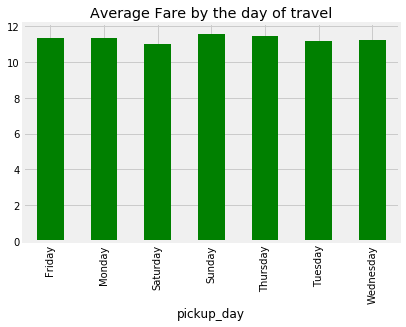


```python
data.groupby('year')['fare_amount'].mean().plot.bar(color = 'g')
plt.title('Average Fare by the year')
```


    Text(0.5, 1.0, 'Average Fare by the year')


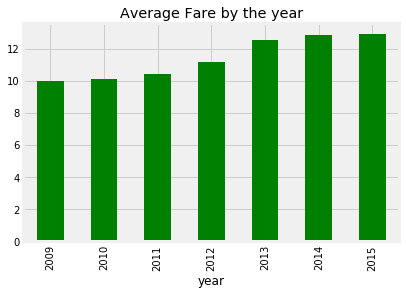


```python
fig, ax = plt.subplots(1, 1, figsize=(14,6))

i=0
for b, df in data.groupby('year'):
    p = df.groupby('hour', as_index=True).aggregate({'fare_per_km': np.mean}).plot(ax=ax, legend = False, c=colors[i])
    p.set_xlabel("Hour of the day")
    p.set_ylabel("Average fare per km")
    p.set_title('Hours of day vs Average fare per km ')
    print('Year',b,' is colored as ',colors[i])
    i=i+1
plt.show()
```

    Year 2009  is colored as  b
    Year 2010  is colored as  g
    Year 2011  is colored as  r
    Year 2012  is colored as  c
    Year 2013  is colored as  m
    Year 2014  is colored as  y
    Year 2015  is colored as  yellowgreen


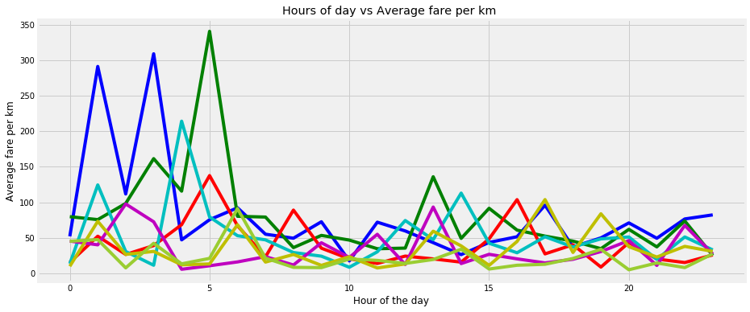


As you can see here, 2009 and 2010 were the most expensive years for Taxi and it is considerbally more expensive to take a taxi late at night or early in the morning then it is to take in the middle of the day. After afternoon though the prises increase than the morning. Looking at this, we can say that `year` and `hour` will be a significant variable in our model. 

# Machine Learning


```python
from sklearn.linear_model import LinearRegression
from sklearn.model_selection import train_test_split
from sklearn.tree import DecisionTreeRegressor
from sklearn.neighbors import KNeighborsRegressor
from sklearn.ensemble import RandomForestRegressor
from sklearn.tree import DecisionTreeRegressor
from sklearn.svm import LinearSVR
from sklearn.feature_selection import f_regression
from sklearn.metrics import mean_squared_error
from sklearn.model_selection import cross_val_score
from sklearn.model_selection import GridSearchCV
```

## 5.1 Splitting Data

Lets now just split the data and then train a linear regression model with not a lot of variables.


```python
# Split data
X_train, X_valid, y_train, y_valid = train_test_split(data, np.array(data['fare_amount']), stratify = data['fare_bin'], random_state = seed)
```

## 5.2 Finding Correlations

First lets plot out a correlation table to test what variables correlate. This will help us choose features on which we should train our models.


```python
plt.figure(figsize=(13,13))
plt.title("Correlation Heatmap of fare_amount and all other variables", fontsize=20)
sns.heatmap(data.corr(), cmap=sns.diverging_palette(220, 10, as_cmap=True), annot=True)
plt.show()
```


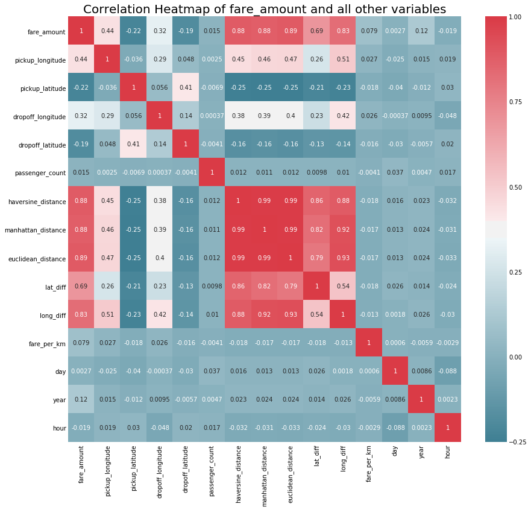


This heatmap shows us that the `fare_amount` is correlated mostly to distances but also the distances are correlated to each other. Therefore when making a model we should consider using only one of the distance and if 2 distances are used then an interaction term should be kept in mind so that the predictions are not bias.

Before doint anything lets take a look at what features we should be using.

## 5.3 Hypothesis Testing 

We are looking at the impacts of a lot of things on `fare_amount`.

**Null Hypothesis**: None of the attributes have a noticeable impact on the `fare_amount`.

To test this lets make a regression and see the F values and the P-value associated with them.


```python
cols = ['pickup_longitude', 'pickup_latitude','dropoff_longitude', 'dropoff_latitude', 
        'passenger_count', 'haversine_distance', 'manhattan_distance', 'euclidean_distance',   
        'lat_diff', 'long_diff', 'fare_per_km', 'day', 'year','hour']
```


```python
from statsmodels import api as sm

X= X_train[cols]
y = y_train

#add a constant to the features
sm_X = sm.add_constant(X)

# use Ordinary Least Squares
OLS_model = sm.OLS(y,X).fit()
OLS_model.summary()
```


<table class="simpletable">
<caption>OLS Regression Results</caption>
<tr>
  <th>Dep. Variable:</th>            <td>y</td>        <th>  R-squared:         </th>  <td>   0.927</td>  
</tr>
<tr>
  <th>Model:</th>                   <td>OLS</td>       <th>  Adj. R-squared:    </th>  <td>   0.927</td>  
</tr>
<tr>
  <th>Method:</th>             <td>Least Squares</td>  <th>  F-statistic:       </th>  <td>7.089e+05</td> 
</tr>
<tr>
  <th>Date:</th>             <td>Fri, 14 Dec 2018</td> <th>  Prob (F-statistic):</th>   <td>  0.00</td>   
</tr>
<tr>
  <th>Time:</th>                 <td>18:41:50</td>     <th>  Log-Likelihood:    </th> <td>-2.0204e+06</td>
</tr>
<tr>
  <th>No. Observations:</th>      <td>722941</td>      <th>  AIC:               </th>  <td>4.041e+06</td> 
</tr>
<tr>
  <th>Df Residuals:</th>          <td>722928</td>      <th>  BIC:               </th>  <td>4.041e+06</td> 
</tr>
<tr>
  <th>Df Model:</th>              <td>    13</td>      <th>                     </th>      <td> </td>     
</tr>
<tr>
  <th>Covariance Type:</th>      <td>nonrobust</td>    <th>                     </th>      <td> </td>     
</tr>
</table>
<table class="simpletable">
<tr>
           <td></td>             <th>coef</th>     <th>std err</th>      <th>t</th>      <th>P>|t|</th>  <th>[0.025</th>    <th>0.975]</th>  
</tr>
<tr>
  <th>pickup_longitude</th>   <td>   11.3909</td> <td>    0.129</td> <td>   88.026</td> <td> 0.000</td> <td>   11.137</td> <td>   11.645</td>
</tr>
<tr>
  <th>pickup_latitude</th>    <td>    2.6012</td> <td>    0.185</td> <td>   14.030</td> <td> 0.000</td> <td>    2.238</td> <td>    2.965</td>
</tr>
<tr>
  <th>dropoff_longitude</th>  <td>   -5.0876</td> <td>    0.124</td> <td>  -41.189</td> <td> 0.000</td> <td>   -5.330</td> <td>   -4.846</td>
</tr>
<tr>
  <th>dropoff_latitude</th>   <td>  -14.0751</td> <td>    0.162</td> <td>  -86.916</td> <td> 0.000</td> <td>  -14.392</td> <td>  -13.758</td>
</tr>
<tr>
  <th>passenger_count</th>    <td>    0.0354</td> <td>    0.004</td> <td>    9.940</td> <td> 0.000</td> <td>    0.028</td> <td>    0.042</td>
</tr>
<tr>
  <th>haversine_distance</th> <td>   -3.6044</td> <td>    0.116</td> <td>  -31.009</td> <td> 0.000</td> <td>   -3.832</td> <td>   -3.377</td>
</tr>
<tr>
  <th>manhattan_distance</th> <td>  -74.8252</td> <td>    0.562</td> <td> -133.038</td> <td> 0.000</td> <td>  -75.928</td> <td>  -73.723</td>
</tr>
<tr>
  <th>euclidean_distance</th> <td>  714.8768</td> <td>   11.422</td> <td>   62.590</td> <td> 0.000</td> <td>  692.491</td> <td>  737.263</td>
</tr>
<tr>
  <th>lat_diff</th>           <td>   25.7457</td> <td>    1.900</td> <td>   13.549</td> <td> 0.000</td> <td>   22.021</td> <td>   29.470</td>
</tr>
<tr>
  <th>long_diff</th>          <td> -100.5709</td> <td>    1.897</td> <td>  -53.013</td> <td> 0.000</td> <td> -104.289</td> <td>  -96.853</td>
</tr>
<tr>
  <th>fare_per_km</th>        <td>    0.0004</td> <td> 2.03e-06</td> <td>  189.754</td> <td> 0.000</td> <td>    0.000</td> <td>    0.000</td>
</tr>
<tr>
  <th>day</th>                <td>   -0.0445</td> <td>    0.002</td> <td>  -18.549</td> <td> 0.000</td> <td>   -0.049</td> <td>   -0.040</td>
</tr>
<tr>
  <th>year</th>               <td>    0.4661</td> <td>    0.002</td> <td>  192.889</td> <td> 0.000</td> <td>    0.461</td> <td>    0.471</td>
</tr>
<tr>
  <th>hour</th>               <td>    0.0112</td> <td>    0.001</td> <td>   15.507</td> <td> 0.000</td> <td>    0.010</td> <td>    0.013</td>
</tr>
</table>
<table class="simpletable">
<tr>
  <th>Omnibus:</th>       <td>723770.748</td> <th>  Durbin-Watson:     </th>   <td>   1.996</td>   
</tr>
<tr>
  <th>Prob(Omnibus):</th>   <td> 0.000</td>   <th>  Jarque-Bera (JB):  </th> <td>201484347.010</td>
</tr>
<tr>
  <th>Skew:</th>            <td> 4.368</td>   <th>  Prob(JB):          </th>   <td>    0.00</td>   
</tr>
<tr>
  <th>Kurtosis:</th>        <td>84.317</td>   <th>  Cond. No.          </th>   <td>6.22e+19</td>   
</tr>
</table><br/><br/>Warnings:<br/>[1] Standard Errors assume that the covariance matrix of the errors is correctly specified.<br/>[2] The smallest eigenvalue is 9.87e-28. This might indicate that there are<br/>strong multicollinearity problems or that the design matrix is singular.


After looking at this and considering our significance value of 0.05, there is sufficient evidence to **reject the Null hypothesis** and saw that there might be a relationship with the dependent variable `fare_amount`.

Some concern might be of the R-squared value of 0.927 which might mean that we might have overfit our data. We will take a look at this later when we are trying to model non-linear regressions. 

As you can see all the cols act as good feature for the model but we cannot use all distances at once because they are highly correlated. For our model we cannot use any 2 variables which are highly correlated. Therfore I choose some features whose f values will come out to be the maximum.

## 5.4 F Tests


```python
f_scores, p_values = f_regression(X_train[cols], y_train)
for i in range(len(cols)):
    print('Feature',cols[i])
    print('F Value',round(f_scores[i],4))
    print('P Value',p_values[i])
    print()
```

    Feature pickup_longitude
    F Value 169578.2521
    P Value 0.0
    
    Feature pickup_latitude
    F Value 36359.007
    P Value 0.0
    
    Feature dropoff_longitude
    F Value 84467.8839
    P Value 0.0
    
    Feature dropoff_latitude
    F Value 26562.883
    P Value 0.0
    
    Feature passenger_count
    F Value 180.1921
    P Value 4.450569130926191e-41
    
    Feature haversine_distance
    F Value 2575886.9882
    P Value 0.0
    
    Feature manhattan_distance
    F Value 2411847.3968
    P Value 0.0
    
    Feature euclidean_distance
    F Value 2796496.9778
    P Value 0.0
    
    Feature lat_diff
    F Value 659339.8593
    P Value 0.0
    
    Feature long_diff
    F Value 1586523.4691
    P Value 0.0
    
    Feature fare_per_km
    F Value 4683.2604
    P Value 0.0
    
    Feature day
    F Value 7.7309
    P Value 0.005428537062627677
    
    Feature year
    F Value 10643.4258
    P Value 0.0
    
    Feature hour
    F Value 267.0003
    P Value 5.24175101532613e-60
    


It looks like all of the columns we were looking at have p values which are close to 0. Moreover looking at the F values I think we should use `pickup_longitude`, `pickup_latitude`,`dropoff_longitude`, 
`dropoff_latitude`, `passenger_count`,`haversine_distance`,`long_diff`,`lat_diff`,`day`,`year` and `hour` as features in our model. 

## 5.5 Making Predictions

### Linear Model

Lets create a simple linear regression model with features as `passenger_count` and `haversine_distance` and then lets find its square mean error. 


```python
linear1 = LinearRegression().fit(X_train[['passenger_count','haversine_distance']], y_train)
```


```python
print( linear1.intercept_,' is the intercept of the model')
print( linear1.coef_[0],' is the coefficient for passenger count')
print( linear1.coef_[1],' is the coefficient for haversine distance')
```

    3.454375954497558  is the intercept of the model
    0.034443223519930795  is the coefficient for passenger count
    2.3278743661513563  is the coefficient for haversine distance


This means for every passenger the `fare_amount` increases by \\$0.33 and for very `haversine_distance` travelled it increases by \\$2.32. 

Now lets find the mean scored error to score our model. 


```python
mean_squared_error( y_valid , linear1.predict(X_valid[['passenger_count','haversine_distance']]) )
```


    19.117414719081623


Lets try to do better by adding more features. 


```python
features = ['pickup_longitude', 'pickup_latitude','dropoff_longitude', 
'dropoff_latitude', 'passenger_count','haversine_distance','long_diff','lat_diff','day','year','hour']
```


```python
linear2 = LinearRegression().fit(X_train[features], y_train)
```


```python
print( linear2.intercept_,' is the intercept of the model')
print( linear2.coef_[4],' is the coefficient for passenger count')
print( linear2.coef_[5],' is the coefficient for haversine distance')
```

    -794.846848540314  is the intercept of the model
    0.03210273478955826  is the coefficient for passenger count
    3.646548843004844  is the coefficient for haversine distance


```python
scores = cross_val_score(linear2, X_train[features], y_train, cv=10)
print("Accuracy: %0.2f (+/- %0.2f) for a Linear Regression  from 10 fold cross-validation" % (scores.mean(), scores.std() * 2))
```

    Accuracy: 0.81 (+/- 0.01) for a Linear Regression  from 10 fold cross-validation


```python
linear2_prediction = linear2.predict(X_valid[features])
```


```python
mean_squared_error( y_valid ,  linear2_prediction)
```


    16.412474585460068


```python
linear2.score(X_train[features], y_train)
```


    0.8117285370429997


```python
sns.set(rc={'figure.figsize':(15,5)})
sns.kdeplot(y_valid,  label = 'Actual')
sns.kdeplot(linear2_prediction,  label = 'Linear_predicted')
plt.show()
```


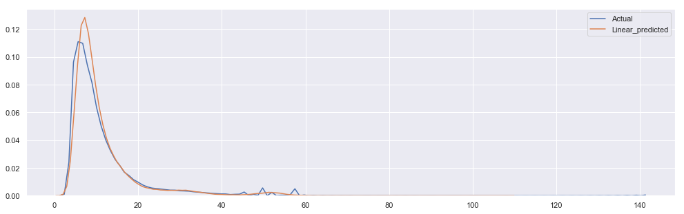


The lower our mean sqaured error will be the better we were able to fit our model. It seems that we can do better if we take a look at other models. Lets take a look at how good other models are and then in the end analyse the one which gave the best score. 

### Random Forest


```python
# Fitting Model with RandomForest Algorithm and then printing the score of the predictions
rfr = RandomForestRegressor().fit(X_train[features], y_train)
```


```python
scores = cross_val_score(rfr, X_train[features], y_train, cv=10)
print("Accuracy: %0.2f (+/- %0.2f) for a Random Forest from 10 fold cross-validation" % (scores.mean(), scores.std() * 2))
```

    Accuracy: 0.86 (+/- 0.01) for a Random Forest from 10 fold cross-validation


```python
rfr_prediction = rfr.predict(X_valid[features]) 
```


```python
mean_squared_error( y_valid , rfr_prediction )
```


    12.257310301928364


```python
rfr.score(X_train[features], y_train)
```


    0.9740410000508551


```python
sns.set(rc={'figure.figsize':(15,5)})
sns.kdeplot(y_valid,  label = 'Actual')
sns.kdeplot(rfr_prediction,  label = 'Random_forest_predicted')
plt.show()
```


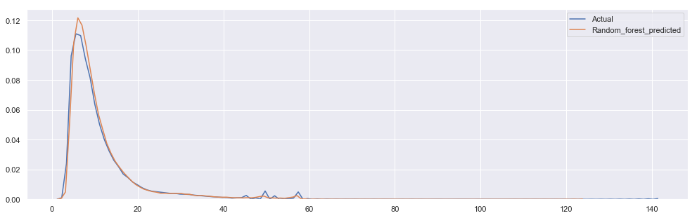


### K-NN model


```python
knn = KNeighborsRegressor(n_neighbors=20).fit(X_train[features], y_train)
```


```python
scores = cross_val_score(knn, X_train[features], y_train, cv=10)
print("Accuracy: %0.2f (+/- %0.2f) for KNN from 10 fold cross-validation" % (scores.mean(), scores.std() * 2))
```

    Accuracy: 0.81 (+/- 0.01) for KNN from 10 fold cross-validation


```python
knn_prediction = knn.predict(X_valid[features]) 
```


```python
mean_squared_error( y_valid , knn_prediction )
```


    16.239174284268255


```python
knn.score(X_train[features], y_train)
```


    0.8310144835024129


```python
sns.set(rc={'figure.figsize':(15,5)})
sns.kdeplot(y_valid,  label = 'Actual')
sns.kdeplot(knn_prediction,  label = 'Knn_predicted')
plt.show()
```


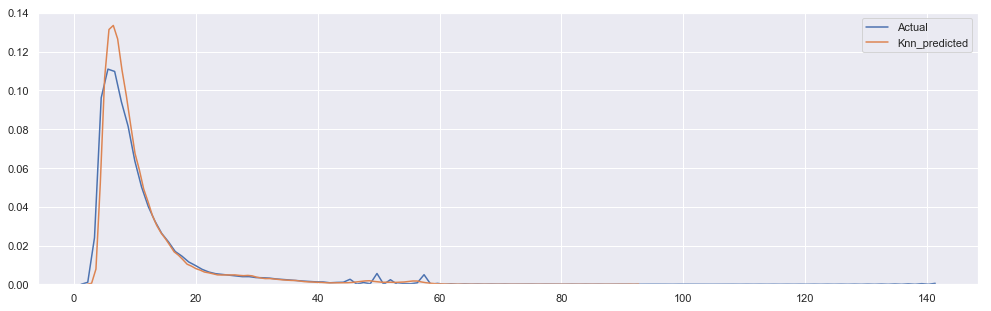


### Decision Trees


```python
decisionTree = DecisionTreeRegressor().fit(X_train[features], y_train)
```


```python
scores = cross_val_score(decisionTree, X_train[features], y_train, cv=10)
print("Accuracy: %0.2f (+/- %0.2f) for Decision Tree from 10 fold cross-validation" % (scores.mean(), scores.std() * 2))
```

    Accuracy: 0.74 (+/- 0.02) for Decision Tree from 10 fold cross-validation


```python
dt_prediction = decisionTree.predict(X_valid[features]) 
```


```python
mean_squared_error( y_valid , dt_prediction )
```


    22.444567395354817


```python
decisionTree.score(X_train[features], y_train)
```


    1.0


```python
sns.set(rc={'figure.figsize':(15,5)})
sns.kdeplot(y_valid,  label = 'Actual')
sns.kdeplot(dt_prediction,  label = 'Decision_tree_predicted')
plt.show()
```


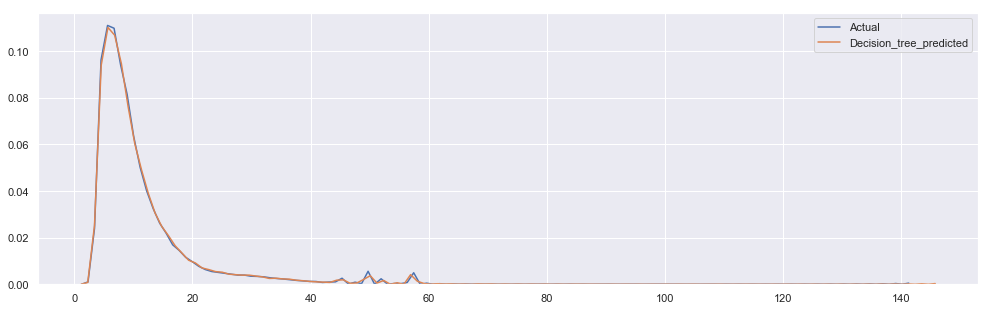


### Linear SVR


```python
SVR = LinearSVR().fit(X_train[features], y_train)
```


```python
scores = cross_val_score(SVR, X_train[features], y_train, cv=10)
print("Accuracy: %0.2f (+/- %0.2f) for Linear SVR from 10 fold cross-validation" % (scores.mean(), scores.std() * 2))
```

    Accuracy: 0.76 (+/- 0.06) for Linear SVR from 10 fold cross-validation


```python
SVR_prediction = SVR.predict(X_valid[features]) 
```


```python
mean_squared_error( y_valid , SVR_prediction )
```


    35.77671598388294


```python
SVR.score(X_train[features], y_train)
```


    0.5907816139759132


```python
sns.set(rc={'figure.figsize':(15,5)})
sns.kdeplot(y_valid,  label = 'Actual')
sns.kdeplot(SVR_prediction,  label = 'Linear_SVR_predicted')
plt.show()
```


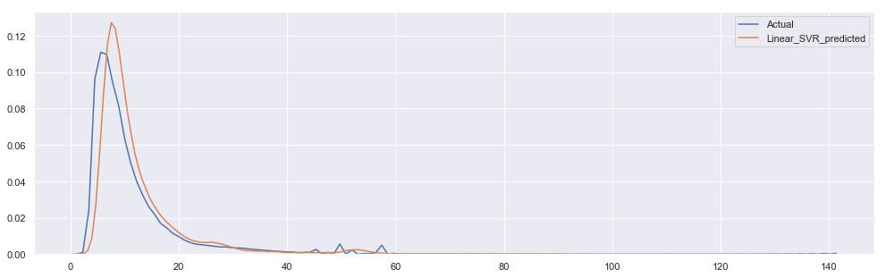


# Conclusion

It looks like the we should use Random Forest to predict the `fare_amount` from the features we have. Lets take a look at what the best hyper parameters are of the model. 

## Tuning the model


```python
param_grid3 = {"n_estimators": [20, 40],
              "max_depth": [10, 20]}

grid_search = GridSearchCV(rfr, param_grid=param_grid3,n_jobs = 3, cv = 10)
grid_search.fit(X_train[features], y_train)
```


    GridSearchCV(cv=10, error_score='raise-deprecating',
           estimator=RandomForestRegressor(bootstrap=True, criterion='mse', max_depth=None,
               max_features='auto', max_leaf_nodes=None,
               min_impurity_decrease=0.0, min_impurity_split=None,
               min_samples_leaf=1, min_samples_split=2,
               min_weight_fraction_leaf=0.0, n_estimators=10, n_jobs=None,
               oob_score=False, random_state=None, verbose=0, warm_start=False),
           fit_params=None, iid='warn', n_jobs=3,
           param_grid={'n_estimators': [20, 40], 'max_depth': [10, 20]},
           pre_dispatch='2*n_jobs', refit=True, return_train_score='warn',
           scoring=None, verbose=0)


```python
grid_search.best_estimator_
```


    RandomForestRegressor(bootstrap=True, criterion='mse', max_depth=20,
               max_features='auto', max_leaf_nodes=None,
               min_impurity_decrease=0.0, min_impurity_split=None,
               min_samples_leaf=1, min_samples_split=2,
               min_weight_fraction_leaf=0.0, n_estimators=40, n_jobs=None,
               oob_score=False, random_state=None, verbose=0, warm_start=False)


```python
scores = cross_val_score(grid_search.best_estimator_, X_train[features], y_train, cv=10)
print("Accuracy: %0.2f (+/- %0.2f) for Best Random Forest Model from 10 fold cross-validation" % (scores.mean(), scores.std() * 2))
```

    Accuracy: 0.87 (+/- 0.01) for Best Random Forest Model from 10 fold cross-validation


Now lets see what import features are

## Feature Importance

Lets see what are the most important feature used in our model and also rank the others. 


```python
rfr= grid_search.best_estimator_
importances = rfr.feature_importances_
std = np.std([tree.feature_importances_ for tree in rfr.estimators_],
             axis=0)
indices = np.argsort(importances)[::-1]

x_labels = []

# Print the feature ranking
print("Feature ranking:")

for f in range(11):
    print("%d. feature %s (%f)" % (f + 1, features[indices[f]], importances[indices[f]]))
    x_labels.append(features[indices[f]])

# Plot the feature importances of the forest
plt.figure()
plt.title("Feature importances")
plt.bar(range(11), importances[indices],color="r", yerr=std[indices], align="center")
plt.xticks(range(11), x_labels)
plt.xlim([-1,11])
plt.show()
```

    Feature ranking:
    1. feature haversine_distance (0.814605)
    2. feature long_diff (0.046292)
    3. feature dropoff_longitude (0.035391)
    4. feature year (0.024158)
    5. feature pickup_longitude (0.017799)
    6. feature dropoff_latitude (0.016371)
    7. feature lat_diff (0.015687)
    8. feature pickup_latitude (0.012202)
    9. feature hour (0.010810)
    10. feature day (0.004602)
    11. feature passenger_count (0.002085)


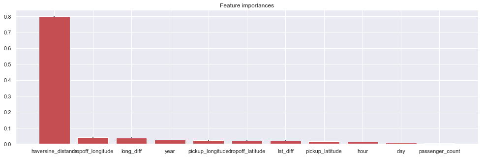


As you can see above our `fare_amount` is mostly dependent on `haversine_distance` and is somewhat dependent on `long_diff`, `year` and `dropoff_longitude`. Therefore predicting the fares can be directly tied to needing atleast these features for a good prediction. Of course we can later add in the new data and the importance of features can change. Right now we are able to predict data with a good accurancy. I wanted to end by running this code which would plot the learning curve and then show that we could benefit from fitting more data but could not as it took forever on my computer. But I am sure that adding more data will definitely increase the accuracy of our model. 

```
from sklearn.model_selection import learning_curve

train_sizes = np.arange(1, data.size,100000)
train_sizes[len(train_sizes)-1] = data.size
train_sizes, train_scores, valid_scores = learning_curve(rfr, X_train[features], y_train, train_sizes=train_sizes, cv=10)           
plt.plot(x=train_sizes, y=train_scores, c= 'b')
plt.plot(x=train_sizes,y=valid_scores, c= 'r')
plt.show()
```

---

Thank you for reading! Any comments/criticisms of methodology, analysis, display, clarity of writing, or lack of any knowledge are warmly welcomed!
